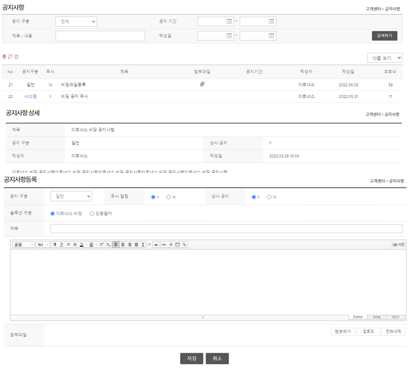

# I. 실습직무
## 1. 개요
### 1) 이트너스 비딩 플랫폼 WEB
이트너스 비딩은 2013년도부터 이트너스에서 매각 관련한 전체 프로세스를 온라인 시스템을 통해 일괄 처리 가능하게 한 기업자산매칭 솔루션이다. 
매각 의뢰사에서 매각 물품 리스트를 이트너스 비딩 담당자에게 송부하면, 현장실사가 진행된다. 구매사에서는 해당 현장실사에 참여하여 입찰에 참여할 수 있다. 최종 낙찰 된 구매사로부터 낙찰 금액이 입금되면 성공적으로 매칭이 끝난다.

이 프로젝트에서 비딩 WEB의 공지사항·1:1문의·자주묻는질문·차량 코드관리 게시판의 목록, 등록/수정/삭제, 상세보기를 담당하였다. 또한, 기존 웹의 개선 사항에 대해서도 개발을 진행하였다.

### 2) 감동줄카 MOBILE API
'감동줄카' 솔루션은 이트너스 비딩에서 중고차 관련 매물 부분을 따로 분리한 것으로, 이번에 새롭게 기획되었다. 이 프로젝트에서 감동줄카의 AOS/IOS 모바일 앱을 위한 공지사항·1:1문의·자주묻는질문의 CRUD API를 구현 하였다.

# 실습 직무 상세 내용
### 프로세스 정리
(실습직무 프로세스 그림 동일하게 사용하면 될 것 같음.)

### 기술 스택
- Java Server Pages, Javascript
- Spring, MyBatis
- OracleDB

- dev-ops : Gitlab, Jenkins
- 협업툴 : Slack, Jira

### 타 팀과의 협업
이전의 프로젝트들은 대부분 현재 속한 PL(Platform Leading)팀 내부에서 소규모로 진행되었다. 따라서 PL팀 내부 혹은 디자인 팀과의 커뮤니케이션 정도만을 요했다. 반면, 본 프로젝트는 PD(Project Development)팀이 진행중인 프로젝트에 투입되어 대규모의 인원으로 진행되는 프로젝트였다. 기존 기획/개발 사항에 대해서도 지속적인 커뮤니케이션이 필요하였고, 발견되는 이슈사항에 대해서도 빠른 공유가 필요했다. 
개발과정에서 모바일 앱 api의 경우 반드시 필요한 데이터만을 전달하는 것이 요구 되었기에, 프론트와 API 담당자간 지속적 소통이 필요했고, AOS와 IOS의 차이에 의해 기획부터 변경되어야 할 부분도 있어 많은 소통이 요구되었다.

### 첫 Legacy Code 개발 경험
기존 프로젝트들에서는 vue.js와 Spring JPA와 같은 최신의 기술들을 활용하여 기능을 구현해갔다. 이 프로젝트는 앞 서술과 같이 2013년도 부터 사용되어온 Legacy Project로, 최초로 JSP와 MyBatis라는 기술 스택을 접하게 되었다. 처음 접해 본 기술들이었지만, 협업과 질문을 통해 빠르게 익혀가며 기존의 코드를 이해하고 기능을 구현해갔다.

### 기본적인 CRUD 게시판의 구현
공지사항·1:1문의·자주묻는질문·차량 코드관리 게시판에서 공통적으로 CRUD를 구현하였다.
  

이트너스 비딩의 장점 (혹시 몰라서 적어놓음)

이트너스 업체 소싱부터 회계 처리까지 전체 매각 프로세스에 대해 이트너스 비딩 담당자가 관리, 감독하여 이용 업체에게 업무 편의를 제공한다. 또한 엄격한 관리로 부정행위를 차단하기 때문에 보다 공정하게 매각·입찰 프로세스를 진행할 수 있다.  
<!-- summary 아래 한칸 공백 두어야함 -->

레거시에서 테스트코드 장점 블로그 글

왜 테스트 코드를 작성하는게 더 빨라요?  
테스트 코드를 작성하면 절대적인 코드 양이 늘어난다.
그만큼 시간을 써야한다고 느끼는 것이다.
하지만 조금만 경험을 돌이켜보면 그렇지 않다.

테스트 코드가 없을 때
코드가 올바르게 작동하는지 확인하려면 print나 log(혹은 그런 비슷한 행위)를 하며 확인을 해야 할 것이다.
매번 코드를 실행시켜야 하고, 해당 지점까지 가서 확인해야 한다.
경우에 따라서는 실행 후에 확인 해야 하는 지점에 도달할 때 까지 몇번의 클릭과 몇번의 타이핑이 매번 들어가야 하는 일도 생긴다.

테스트 코드가 있을 때
코드가 올바르게 작동하는지 곧장 피드백을 받을 수 있다.
문제가 생긴다면 테스트 코드가 해당 지점으로 네비게이션 역할을 해주기에 문제 지점도 빠르게 찾을 수 있다.

왜 이렇게 짰습니까? 미쳤습니까 휴먼

테스트의 작성은 개발자가 함수나 메서드를 작고 간단하게 만들도록 유도한다.
유지보수 하기 쉽게 작성 될 확률이 높아지는 것이다.

그리고, 테스트 코드는 일종의 인수인계 문서이며 소통 수단이다.

단기적으로는 빠른 피드백으로 코드의 이상유무를 빠르게 확인이 가능하고,
장기적으로는 유지보수가 가능하고 알아볼 수 있는 코드가 되어서 시간을 절약해준다.

<!-- summary 아래 한칸 공백 두어야함 -->

