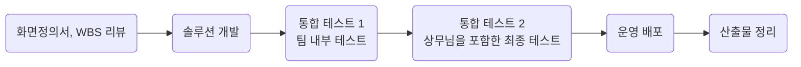

<link href='../css/word.css' type='text/css' rel='stylesheet'>

# I. IPP 실습직무

## 1. 실습직무
### 1) 개요
**이트너스 무빙 플랫폼 VOC 개선**  
[이트너스 무빙](https://etnersmoving.com/)은 해외이사 플랫폼으로 주재원의 부임 또는 귀임 이사를 지원하는 솔루션이다. 클라이언트가 이트너스 무빙을 통해 견적을 신청하면 여러 이사업체들이 견적을 내서 견적서를 작성한다. 클라이언트는 견적들을 비교하여 업체를 선정하고 해당 업체와 이사 일정을 조율하게 된다.  
이트너스 무빙은 해외이사 플랫폼으로 해외이주를 해야하는 사용자의 번거로움을 돕는다. 첫 째, 여러 업체의 견적확인 부터 비용 정산까지 하나의 플랫폼을 통해 해결할 수 있어 효율적인 업무에 도움을 준다. 둘 째, 여러 이사업체의 견적들을 동시에 확인할 수 있어 최적의 단가 산출 및 이주업체 선정을 돕는다. 셋 째, 보상금 책정과 관련해 보험사와 협의를 진행하고, 보상 협의가 완료된 후에 비용청구 진행까지 돕는다.  

**이트너스 무빙 플랫폼 Mobile 페이지 구현**   
해외에서 사이트에 접속하는 경우, 사용자는 모바일로 사이트에 접근이 더 용이하다. 그러나 이트너스 무빙은 웹만을 기준으로 개발되어 있기 때문에 모바일로 접근할 경우 UI/UX가 최적화 되어있지 않아 사용자에게 불편하다. 이를 개선하기 위해 사용자 중 이사업체와 클라이언트가 모바일 디바이스로 사이트에 접근 시, 모바일 전용 페이지로 접속할 수 있도록 한다. 이 프로젝트를 통해 사용자들에게 제품 사용의 편의를 더한다.  

### 2) 실습직무 프로세스

### 3) 실습직무 상세 내용

### 3)-1. 사용 언어 및 기술 스택
- JSP
- JAVA 6 (jdk 1.6)
- MyBatis 
- Apache Tomcat 7

### 3)-2. **이트너스 무빙 플랫폼 VOC 개선** 
기간: 2022/03/29 ~ 2022/05/09  

이트너스 무빙은 처음으로 단순한 게시판 형식의 CRUD를 벗어나 솔루션의 새로운 기능을 개발하게 된 프로젝트이다. 이트너스 무빙에 대한 프로젝트는 크게 VOC 개선과 모바일 작업으로 나눌 수 있다.  

이트너스 무빙 플랫폼 VOC 개선 작업은 무빙에서 제공하는 해외이사업체 플랫폼 서비스에 신규 프로세스를 추가하는 프로젝트이다. 개선 이전에는 클라이언트가 이사업체를 최종으로 선정한 경우, 견적 신청 또는 선정했던 업체를 수정할 수 없다. 그러나 실제 업무 중, 수정해야하는 상황이 생기곤 하여 해당 프로세스를 추가해달라는 요청이 있었다. 

[표1-권한설명]

요청사항을 반영하기 위해 **표1**에 해당하는 권한을 각 수정 주체에게 부여할 경우, 각 권한에 대한 수정 프로세스를 거칠 수 있도록 구현하였다.

[그림1-동의서 확인 프로세스]
[그림2-운송수단변경 프로세스]
[그림3-지원한도변경 프로세스]
[그림4-최종업체변경 프로세스]

실습 직무 상세에 대하여 서술하기에 앞서, 본 글에서 견적 신청은 클라이언트 사용자가 이사를 진행하기 위해 등록한 신청(견적 테이블의 레코드)을 의미하고 견적서는 이사업체 사용자가 클라이언트 사용자가 등록한 견적 신청에 대해 매긴 견적가에 대한 정보(견적_sub 테이블의 레코드)를 정의한다. 견적_sub 테이블은 견적 테이블의 하위 테이블로 클라이언트가 하나의 견적 신청(견적 테이블)을 하면서 방문업체를 선정하면 방문업체로 선정된 여러 업체들이 방문일정을 협의하여 방문 견적 후 견적 신청에 대한 견적서(견적_sub 테이블)를 등록할 수 있는 1대다 구조를 갖는다. 

[그림5-TB_QUOT와 TB_QUOT_SUB의 ERD]

#### (1) 견적 수정 권한 부여
수정 권한을 갖는 유저의 종류에 따라 크게 두가지로 나눌 수 있었기 때문에 관리자가 권한을 부여받는 동의서 확인은 체크박스,  클라이언트가 권한을 부여 받는 운송수단변경과 지원범위변경, 최종업체변경은 셀렉트박스로 표현했다.  
또한 이 프로세스는 이미 이사업체가 최종 선정된 후 견적 신청을 수정하는 프로세스이기 때문에 최종 선정된 업체가 바뀔 수 있어 신중하게 진행되어야하는 과정이다. 따라서 권한을 부여할 시, 다시 확인을 요구하는 컨펌창을 띄워 실수로 권한을 부여하는 일을 줄일 수 있도록 하는 등, 유저의 입장에서 UX/UI에 대한 고민을 했다.

[그림6-견적 수정 권한 부여 화면]

#### (2) 견적 신청 수정
권한을 부여 받은 유저가 해당된 권한의 범위까지만 수정이 가능하도록 제한했다. 
업무 프로세스를 이해한 후 특징을 고려하여 정리한 것이 **표1**이다. 
운송수단을 변경하는 경우, 지원 범위의 단위는 운송 수단에 따라 변경되고 업체별로 담당하는 운송수단이 정해져 있어 지원 범위의 변경과 최종 업체의 변경은 불가피하다. 동일한 논리로 지원범위를 변경하는 경우, 운송 수단은 바뀌지 않아도 되지만 단가가 변경되므로 최종 업체의 변경이 불가피하다.  
 
또한 관리자의 수정 사항 관리의 편의를 위해 견적 신청에 대한 내용을 수정하게 되면 수정 사유를 필수적으로 입력하도록 하고, 미입력하면 수정한 신청이 저장이 되지 않도록 구현하였다.

#### (3) 수정 프로세스 중인 견적 신청에 대한 이사업체의 견적서 등록 및 수정 권한 부여
동의서 확인 혹은 권한 부여를 받은 견적 신청은 수정 프로세스를 진행하게 된다. 이때 일반 도메인과 삼성전자 주재원 전용 도메인은 각각의 프로세스를 밟는다. 삼성전자 주재원은 운송수단이 해상이면 도착지인 국가와 지원한도에 따른 이사업체 단가표가 존재한다. 따라서 삼성전자 주재원은 수정 프로세스를 진행하며 이사업체의 변경이 불가피하게 된다. 이 점을 고려하여 최종업체선정완료 상태의 견적 신청이 수정되면 기존의 견적서를 취소하고 새로 방문업체를 선정하도록 했다.  
그러나 일반의 경우, 견적 신청 수정 전에 등록된 업체의 견적서를 유지해달라는 요청이 있었다. 요청에 따라 견적 신청을 부여받은 권한에 따라 수정한 후 이전에 견적서를 등록한 업체는 견적서를 수정할 수 있도록 하고 그 외에 새로 등록된 이사업체는 방문일정 등록부터 진행하도록 했다.  
또한 권한 부여의 경우, 최종업체변경 권한 외의 권한을 받았을 때 견적 신청의 운송수단이나 지원한도의 변경 없이 이사업체를 추가하면 이 견적 신청에 mapping된 견적서는 수정이나 등록이 불가능하도록 구현해서 수정 이전의 견적 신청을 보고 견적서를 작성하게 되는 예외 상황을 막았다.  

[그림7 견적서 조회 팝업]
[그림8 견적서 등록/수정 팝업]

### 3)-3. **이트너스 무빙 플랫폼 Mobile 페이지 구현**   
기간: 2022/05/04 ~ 2022/06/15

이트너스 무빙 VOC 개선 프로젝트까지의 클라이언트와 이사업체의 프로세스를 모바일 전용 웹 페이지로 옮기는 프로젝트이다. 이 프로젝트에서 중요하게 고려해야 하는 것은 웹과의 통일성과 다양한 기기별로 테스트를 해보며 정상적으로 동작하는지 확인하는 것이었다.  
Back End의 로직은 기존 웹의 것을 그대로 사용했고, Front End를 위한 페이지는 파일을 새로 생성해 작성하였으므로 무빙 VOC 개선 프로젝트보다 훨씬 수월하게 진행할 수 있었다.

#### (1) UI/UX를 고려한 호환성 확인
핸드폰은 기기별로 화면의 비율이 다르기 때문에 화면 비율 별로 깨지게 보이는 버튼이나 그림이 없는지 확인하며 UI를 수정하였다. 보이는 화면 뿐만 아니라 웹을 여는 브라우저에 따라 동작 방식이 조금씩 다른 점 또한 고려해야 했다. 환경에 따라서 동작하지 않는 javascript 메소드가 존재하기 때문이다.   
애플사의 아이폰의 운영체제(IOS)의 Safari 브라우저의 경우 뒤로가기 시, 동일 세션 내에서 이전 페이지를 보다 빠르게 로딩하기 위해 이전에 저장했던 캐싱된 페이지를 바로 불러오는 방법인 BFCache(Back-Forward Cache)를 사용한다. 이 방식을 사용 시 history.back() 메소드를 사용할 때 의도하지 않은 페이지를 보여준다. 또한 데이터를 AJAX를 통해 넘기는 데에도 문제를 일으켜 이를 해결하기 위해 모달 요소 중 하나인 dialog를 이용해 구현하였다.  

[그림9 Dialog를 사용한 팝업]

#### (2) 솔루션의 통일성 유지
모바일의 근원이 되는 데스크탑 용 웹페이지와 화면상의 UI를 유지하도록 했다. 디자인팀에 요청을 보내어 UI/UX적으로 유저가 사용함에 있어 보다 직관적으로 기능을 이해할 수 있고, 웹과 동떨어지지 않아 두 가지를 동시에 사용하더라도 어색하지 않게 했다. 
그러나 무조건 웹의 방식을 유지한 것은 아니다. 이트너스 무빙은 2011년도 부터 존재했던 래거시 솔루션이기 때문에 사용하는 방식이 상당히 오래된 경우도 존재한다. 국내 이사 신청 시 사용되는 주소 검색 API의 경우, 연구소의 다른 솔루션에서 사용되는 주소 검색 API를 적용하였다. 데스크탑용 웹페이지에서 사용되는 주소검색 API는 상당히 오래된 API인데에 반해 다른 솔루션에서 사용되는 API는 가장 최신의 것으로 연구소 내부적으로 앞으로 개발되는 솔루션은 해당 API로 통일을 하기로 했기 때문이다. 이를 통해 비록 웹과의 완전한 통일성은 깨졌으나, 최신의 것으로 버전을 올리고 연구소 내부적인 통일성은 유지하여 이후의 유지보수에서 용이하게 되었다.

[그림10 모바일 웹의 주소검색 팝업]

#### (3) 근본 솔루션의 문제 해결
모바일용의 웹페이지를 구현하게 되면서 이전에 진행했던 VOC에서 다루지 않았던 부분의 파일을 참고해야하는 일이 많았다. 데스크탑용의 웹페이지와의 호환성을 위하여 로직적인 부분은 그대로 가져와 구현을 했으나 테스트 시 일부 부분이 제대로 동작하지 않는 것을 확인하였다. 지금도 계속 사용되고 있는 솔루션임에도 불구하고 해당 부분에 대해 유저들의 부정적인 피드백이 없었다는 것은 실제 사용이 잘 되고 있지 않거나 불편함을 감내하고 사용하고 있다는 의미이다.  
실제 업무를 수행하는 사업부의 담당자와 연락하여 확인을 해본 결과 문제가 있는 로직들 중에서 국내이사신청에 대한 정보가 데이터베이스에 정확히 저장되지 않는 문제와 날짜를 기반으로 한 검색은 실사용에서 치명적일 수 있다는 결론이 나와서 해당 부분을 분석하고 개선하여 정상 동작하도록 구현하였다.

# 2. 학습한 주요 지식, 기술(핵심기술, 관련기술) 및 능력
## 1) Hard Skill (전공능력) 향상
이트너스 무빙은 2011년도 부터 존재했던 상당히 오래된 래거시 프로젝트이다. 물론 지금까지 했던 다른 프로젝트들 또한 기존의 솔루션에 코드를 추가하는 업무였으나 오랜 시간 유지보수를 거쳤던 만큼 해당 프로젝트의 기술부채가 상당하였다. 그래서 처음으로 새로운 기능을 개발해보는 프로젝트였으나 기존 코드에 대한 이해가 어려웠고 시간 비용이 많이 들었다. 하지만 그만큼 다른 사람이 작성한 코드를 읽어 이해하고 이를 이용해 프로젝트를 진행하는 능력을 기를 수 있었다. 

## 2) Soft Skill (조직적응력, 사회성, 의사소통, 팀워크) 향상
- 의사소통
    학교에서 진행했던 프로젝트들은 대체로 소수의 인원이 팀이 되어 기획과 구현을 함께 진행하였다. 그러나 기업 실습으로 수행하였던 프로젝트들은 이미 존재하는 솔루션에 타인이 전부 기획한 기획서에 의존하여 구현을 해야했다. 이를 위해서 기존 솔루션의 사업 특성과 프로세스를 이해해야 했고 기획서를 읽어보며 기획자의 의도를 파악하는 작업이 선행되어야 했다.  
    이 과정을 제대로 거치지 않으면 애써 구현했던 것들을 전부 되돌리고 처음부터 작업을 해야하는 참사가 일어나게 된다. 그러한 일을 줄이기 위해 확실하지 않은 부분이 있다면 기획서를 작성한 기획자와 실제로 사업 업무를 진행하는 사업부의 담당자와 직/간접적으로 회의와 메일, 사내 메신저, 전화통화를 이용해 끊임없이 소통했다. 소통하는 과정을 통해 회사라는 조직에서 소통을 위해 사용되는 매체와 양식 등을 익히고 어떻게 해야 더욱 효율적으로 소통할 수 있는지 배울 수 있었다.